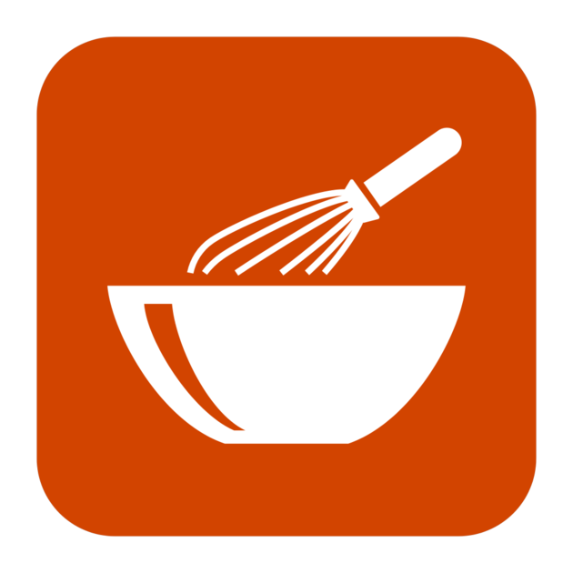

# Recipe App
#### The pandemic is here to stay. People are developing their cooking skills during this time. It is also equally important to have healthy diet. Find out the food and recipes for common food items and label them as balanced, high protein or high carb. 

#### This app is made to find and track calories of different food we eat and also find the recipies of the various food.

#### This app is build to keep our calories in control.

## Set-Up Instructions

- clone the repository using github clone
- go to the main directory by `cd recipe_list`
- run `npm install`
- to start the server run `npm start`
- manage the project

## Available Scripts

In the project directory, you can run:

### `npm start`

Runs the app in the development mode. 
Open [http://localhost:3000](http://localhost:3000) to view it in the browser.

The page will reload if you make edits. 
You will also see any lint errors in the console.

### `npm run build`

Builds the app for production to the `build` folder. 
It correctly bundles React in production mode and optimizes the build for the best performance.

The build is minified and the filenames include the hashes. 
Your app is ready to be deployed!

See the section about [deployment](https://facebook.github.io/create-react-app/docs/deployment) for more information.

### `npm run deploy`

It deploys the application to your presetup github account pages